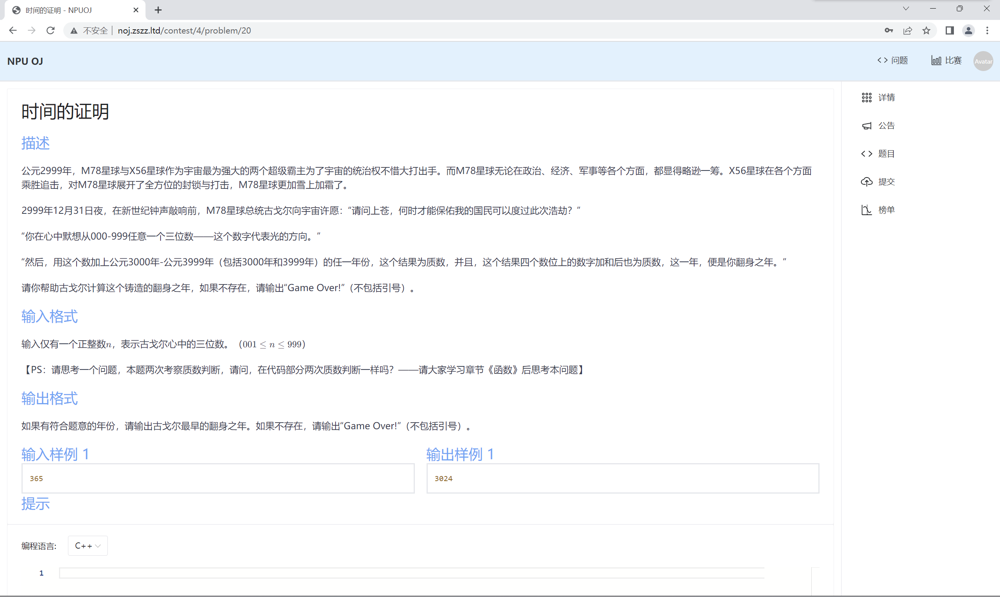
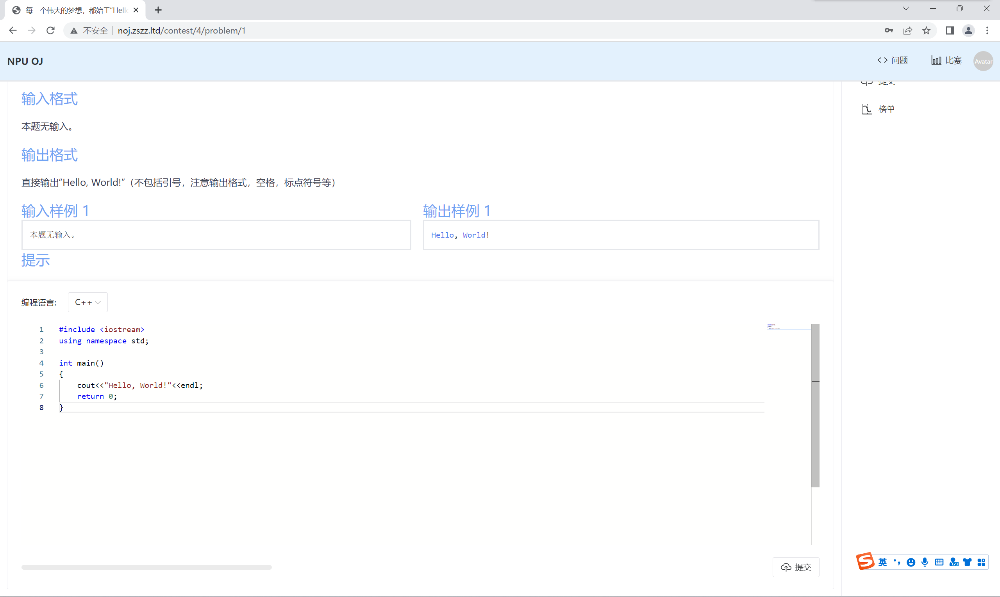

# 进行训练

加入班级之后，单击即可进入班级主页。

### **功能简介**

班级有公告、题目、提交、榜单四个功能。

- 公告：展示授课老师通知、班级训练规定等公开信息。
- 题目：包含所需完成的训练题目。
- 提交：展示班级成员提交代码评测的记录。
- 榜单：展示班级成员训练完成情况排行。

对“题目”版块的操作流程进行介绍。

### 完成题目

单击侧边栏“题目”，即可进入题目列表。可见，页面展示了题目序号、名称、难度和标签（相关知识点）。

单击需要完成的题目，即可进入题目页面。页面展示了题目描述、输入格式、输出格式、样例以及提示（部分题目展示）。

下侧为代码提交窗口，可在窗口直接编写代码，也可在编写完成后粘贴。点击提交即可进行代码评测。

若评测通过，页面将提示AC。

点击可查看详情。

### **代码评测**

同学提交的代码不一定是正确的（或者说，少部分是正确的）。代码评测可能出现以下结果。

| 标识                         | 含义       | 解释                                                         |
| ---------------------------- | ---------- | ------------------------------------------------------------ |
| Pending                      | 运行并评判 | 您的程序正在评测中。                                         |
| Compiling                    | 编译中     | 您的程序正在被编译。                                         |
| Accepted \| AC               | 正确       | 恭喜您，完全正确！                                           |
| Presentation Error \| PE     | 格式错误   | 结果正确，但格式不正确，比如多或少了换行或空格。             |
| Wrong Answer \| WA           | 答案错误   | 经过比对，您的程序错误。                                     |
| Running Error \| RE          | 运行错误   | 程序运行后发生错误，可能包括： 1. 指针/数组违规访问； 2. 除数为0； 3. 函数调用错误，或栈溢出； 4. 捕捉到违背处理的STL或自定义异常等。 |
| Time Limit Exceeded \| TLE   | 时间超限   | 程序运行时间超过了时间限制，请检查程序的算法效率。           |
| Time Limit Exceeded \| TLE   | 内存超限   | 程序使用的内存超过了内存限制，请检查程序是否栈/堆开辟空间过大或内存泄露。 |
| Output Limit Exceeded \| OLE | 输出超限   | 输出了与答案无关的信息，比如“please  input”等提示。          |
| Compile Error \| CE          | 编译错误   | 程序语法错误，编译不通过。可能您在本地可以编译通过，但可能使用了非标准C的函数 ，请使用符合标准的语法。 |
