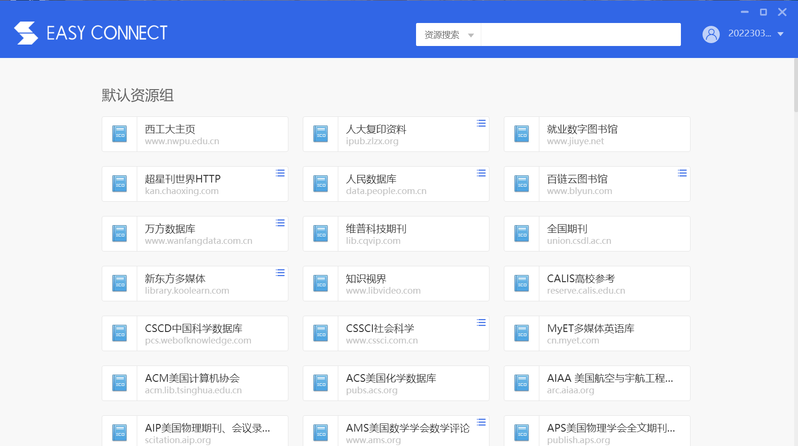

# 开始使用

从这里开始，学习如何使用NOJ。

## 访问网站

NOJ目前仅开放校园网访问，这意味着你无法通过广域网进入网站。

### 校园网访问

如果你正在通过校园网上网，可以直接访问[noj.zszz.ltd](http://noj.zszz.ltd)进入NOJ。

### 广域网访问

如果你正在通过广域网上网，需要使用[西工大VPN](https://vpn.nwpu.edu.cn)进入校园网，再访问[noj.zszz.ltd](http://noj.zszz.ltd)进入NOJ。

VPN的使用方法请见相关网站。

